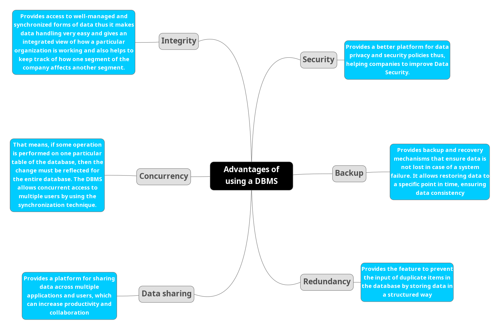

# Database Search and Reporting Task 

----------------------------------------------------------------

## **1. Flat File Systems Vs Relational Databases**
|Comparison      |Flat File Systems                                                          |Relational Databases                                                             |
|----------------|---------------------------------------------------------------------------|---------------------------------------------------------------------------------|
|Data Structure  |Data is stored in a single file or a set of files.                         |Data is stored in tables with rows and columns.                                  |
|Data Redundancy |Data redundancy is high, as the same data may be stored in multiple files. |Data redundancy is low, as data is normalized and stored in a structured manner. |
|Relationships   |No relationships between data elements.                                    |Relationships between data elements are defined using keys.                      |
|Example usage   |Used for simple data storage and retrieval.                                |Used for complex data storage, retrieval, and manipulation.                      |
|Drawbacks       |Difficult to manage and maintain as data grows.                            |More complex to set up and manage than flat file systems.                        |

## **2. Advantages of using a DBMS**

## **3. Roles in a Database System**

### 1. System Analyst

A person who uses analysis and design techniques to solve business problems using information technology.

 - Roles of a systems analyst:
	- Defining user requirements.
	- Problem analysis.
	- Drawing specifications.
	- System design and evaluation.
	- Keeping up to date with technological advancements.
- Skills of a systems analyst:
    - Communication.
	- Critical thinking.
	- Business analytics.
	- Technical analysis.
	- Management.

~~NOTE:~~ 
_The primary purpose of systems analysis is to improve the efficiency, 
effectiveness, and functionality of a system. It helps organizations optimize their processes, 
make informed decisions, and achieve their goals._

### 2. Database Designer 

A person who designs the database structure and schema to meet the requirements of the system.

- Roles of a database designer:
	- Understanding user requirements.
	- Designing the database schema.
	- Normalizing data to eliminate redundancy.
	- Creating data models and diagrams.
	- Ensuring data integrity and security.

- Skills of a database designer:
 	- Data modeling.
	- Database design principles.
	- SQL and database management systems.
	- Problem-solving.
	- Attention to detail.
	
~~NOTE:~~ 
_The primary purpose of database design is to create a well-structured and efficient database
that meets the needs of the organization. It ensures that data is organized, accessible, and secure,
while minimizing redundancy and maintaining data integrity. A well-designed database can improve performance,
reduce maintenance costs, and support the organization's goals and objectives._

### 3. Database Administrator (DBA)

A person responsible for managing and maintaining the database system.

- Roles of a DBA:
	- Installing and configuring the database management system (DBMS).
	- Monitoring database performance and tuning.
	- Implementing security measures.
	- Performing backups and recovery.
	- Managing user access and permissions.

- Skills of a DBA:
	- Database management systems (DBMS).
	- SQL and database programming.
	- Performance tuning and optimization.
	- Backup and recovery techniques.
	- Security and access control.

~~NOTE:~~
_The primary purpose of a database administrator (DBA) is to ensure the availability, performance,
and security of the database system. The DBA is responsible for managing the database environment,
including installation, configuration, monitoring, and maintenance. They also handle user access,
security, and backup and recovery processes. A DBA plays a critical role in ensuring that the database
system meets the needs of the organization and supports its operations effectively._

### 4. Database Developer

A person who develops and maintains database applications and interfaces.

- Roles of a database developer:
	- Designing and implementing database applications.
	- Writing and optimizing SQL queries.
	- Creating stored procedures and triggers.
	- Integrating databases with other applications.
	- Troubleshooting and debugging database issues.
	
- Skills of a database developer:
 	- SQL and database programming.
	- Application development frameworks.
	- Data modeling and design.
	- Performance tuning and optimization.
	- Problem-solving and debugging.
	
~~NOTE:~~
_The primary purpose of a database developer is to create and maintain database applications
that meet the needs of the organization. They are responsible for designing and implementing
database solutions, writing and optimizing SQL queries, and integrating databases with other applications.
A database developer plays a critical role in ensuring that the database system is efficient, reliable,
and meets the requirements of the organization. They also troubleshoot and debug database issues
to ensure smooth operation and performance._

### 5. Application Developer 

A person who develops software applications that interact with the database.

- Roles of an application developer:
	- Designing and developing software applications.
	- Writing code to interact with the database.
	- Implementing business logic and user interfaces.
	- Testing and debugging applications.
	- Collaborating with database developers and administrators.

- Skills of an application developer:
	- Programming languages (e.g., Java, C#, Python).
	- Application development frameworks.
	- Database connectivity and APIs.
	- Software development methodologies.
	- Problem-solving and debugging.

~~NOTE:~~
_The primary purpose of an application developer is to create software applications
that meet the needs of users and organizations. They are responsible for designing and developing
software solutions, writing code to interact with databases, and implementing business logic and user interfaces.
An application developer plays a critical role in ensuring that software applications are efficient, reliable,
and user-friendly. They also test and debug applications to ensure smooth operation and performance.
They collaborate with database developers and administrators to ensure that the applications
integrate seamlessly with the database system and meet the requirements of the organization._

### 6. BI Developer

A person who develops business intelligence solutions to analyze and visualize data.

- Roles of a BI developer:
	- Designing and developing data models and ETL processes.
	- Creating reports and dashboards.
	- Analyzing data to provide insights.
	- Collaborating with stakeholders to understand reporting needs.
	- Ensuring data quality and accuracy.

- Skills of a BI developer:
	- Data warehousing and ETL processes.
	- Business intelligence tools (e.g., Tableau, Power BI).
	- SQL and data analysis.
	- Data visualization techniques.
	- Problem-solving and analytical skills.

~~NOTE:~~
_The primary purpose of a BI developer is to create business intelligence solutions
that help organizations analyze and visualize data to make informed decisions.
They are responsible for designing and developing data models, ETL processes, and reports and dashboards.
A BI developer plays a critical role in ensuring that data is accurate, reliable, and accessible for analysis.
They also collaborate with stakeholders to understand reporting needs and provide insights
that support business objectives. A BI developer helps organizations leverage data to improve performance,
identify trends, and make strategic decisions._

------------------------------------------------------------------------

## **4. Additional Research Topics to Include in the Report:**

### 1. Types of Databases 

- Relational vs Non-Relational:

|Comparison |Relational Databases                                   |Non-Relational Databases                                                         |
|-----------|-------------------------------------------------------|---------------------------------------------------------------------------------|
|Explanation|Structured data stored in tables with rows and columns.|Unstructured or semi-structured data stored in various formats (e.g., JSON, XML).|
|Example    |MySQL, PostgreSQL, Oracle.                             |MongoDB, Cassandra, Couchbase.                                                   |
|Use Cases  |Transactional applications, data warehousing.          |Big data applications, real-time analytics.                                      |

- Centralized vs Distributed vs Cloud Databases

|Comparison |Centralized Databases               |Distributed Databases                    |Cloud Databases                                          |
|-----------|------------------------------------|-----------------------------------------|---------------------------------------------------------|
|Explanation|Data is stored in a single location.|Data is stored across multiple locations.|Data is stored in the cloud, accessible via the internet.|
|Example    |Oracle, MySQL.                      |Cassandra, Amazon DynamoDB.              |Amazon RDS, Google Cloud SQL.                            |
|Use Cases  |Small to medium-sized applications. |Large-scale applications, global reach.  |Scalable applications, pay-as-you-go model.              |

### 2. Cloud Storage and Databases

|Comparison   |Cloud Storage                                            |Cloud Databases                                              |
|-------------|---------------------------------------------------------|-------------------------------------------------------------|
|Explanation  |Data is stored in the cloud, accessible via the internet.|Databases hosted in the cloud, managed by a service provider.|
|Advantages   |Scalability, cost-effectiveness, accessibility.          |Scalability, managed services, high availability.            |
|Disadvantages|Security concerns, dependency on internet connectivity.  |Vendor lock-in, limited control over infrastructure.         |
|Example      |Amazon S3, Google Cloud Storage.                         |Amazon RDS, Google Cloud SQL.                                |

### 3. Database Engines and Languages 

- Database Engine:
  - Definition: A database engine is the underlying software component that enables the creation, 
	            management, and manipulation of databases. It provides the necessary functionality 
	            to store, retrieve, and manage data efficiently.
  - Examples: _MySQL, PostgreSQL, Oracle, MongoDB, SQLite._
	
- Database Language:
  - Definition: A database language is a programming language used to interact with a database. 
				It allows users to perform operations such as querying, updating, and managing data.
  - Examples: _SQL (Structured Query Language), PL/SQL (Procedural Language/SQL), T-SQL (Transact-SQL)._
	
~~NOTE:~~
 - Is there a relationship between the engine and the language?
	
	The engine is what runs or interprets the language, 
	so they are tightly coupled: a language needs an engine to be executed, 
	and an engine is built to understand and execute one or more specific languages.
	
- Can one language work across different engines?

  Yes, some languages can work across different engines, 
  but they may have variations or specific syntax for each engine.
  For example, SQL is a standard language used across various relational database engines,
  but each engine may have its own extensions or variations of SQL.

### 4.  Transfer a Database Between Engines

|Comparison |SQL Server to MySQL                      | Oracle to PostgreSQL                    | MongoDB to Cassandra                              |
|-----------|-----------------------------------------|-----------------------------------------|---------------------------------------------------|
|migrating  |Yes                                      |Yes                                      |Yes                                                |
|tools      |SQL Server Migration Assistant (SSMA)    |Oracle SQL Developer                     |MongoDB Connector for Apache Cassandra             |
|challenges |Data type differences, syntax variations.|Data type differences, syntax variations.|Data model differences, query language differences.|

~~NOTE:~~

- What are the challenges of transferring a database between engines?
  - Data type differences: Different engines may have different data types, 
	which can lead to data loss or conversion issues.
  - Syntax variations: SQL syntax may vary between engines, 
	requiring adjustments to queries and scripts.
  - Data model differences: Different engines may use different data models (e.g., 
	relational vs. document-based), which can complicate the migration process.
  - Performance considerations: Different engines may have different performance characteristics, 
	requiring optimization after migration.
	
- What should we consider before transferring (data types, triggers, stored procedures, etc.)? 
  - __Data types:__ Ensure that the data types used in the source engine are compatible with the target engine.
  - __Triggers:__ Review and adjust triggers to ensure they work correctly in the target engine.
  - __Stored procedures:__ Rewrite or adjust stored procedures to match the syntax and capabilities of the target engine.
  - __Indexes:__ Review and recreate indexes to optimize performance in the target engine.
  - __Data integrity:__ Ensure that data integrity constraints (e.g., primary keys, foreign keys) are maintained during migration.
  - __Backup and recovery:__ Plan for backup and recovery processes before and after migration to prevent data loss.
  - __Testing:__ Thoroughly test the migrated database to ensure functionality and performance meet expectations.
	
	
### 5. Logical vs. Physical Schema 

|Comparison                       |Logical Schema                                                                                                                                                                                                                                                         |Physical Schema                                                                                                                                                                                                                                                   |
|---------------------------------|-----------------------------------------------------------------------------------------------------------------------------------------------------------------------------------------------------------------------------------------------------------------------|------------------------------------------------------------------------------------------------------------------------------------------------------------------------------------------------------------------------------------------------------------------|
|Definition in database design    |A data model of a specific problem domain expressed independently of a particular database management product or storage technology (physical data model) but in terms of data structures such as relational tables and columns, object-oriented classes, or XML tags. |A data model of a specific problem domain expressed in terms of a particular database management product or storage technology (physical data model) but in terms of data structures such as relational tables and columns, object-oriented classes, or XML tags. |
|Important to understand about it |Logical schema is important for understanding the data model and relationships between entities. It provides a high-level view of the data structure without getting into implementation details.                                                                      |Physical schema is important for understanding how the data is stored and accessed in the database. It provides details about storage structures, indexing, partitioning, and performance optimization.                                                           |
|Difference                       |Logical schema focuses on the conceptual design of the database, while physical schema focuses on the implementation details and performance optimization.                                                                                                             |Physical schema is concerned with how the data is stored and accessed in the database, while logical schema is concerned with the overall structure and relationships of the data.                                                                                |
|Example                          |A logical schema may define entities such as "Customer," "Order," and "Product" with their attributes and relationships.                                                                                                                                               |A physical schema may define how the "Customer" entity is stored in a specific database engine, including data types, indexes, and storage parameters.                                                                                                            |

	
